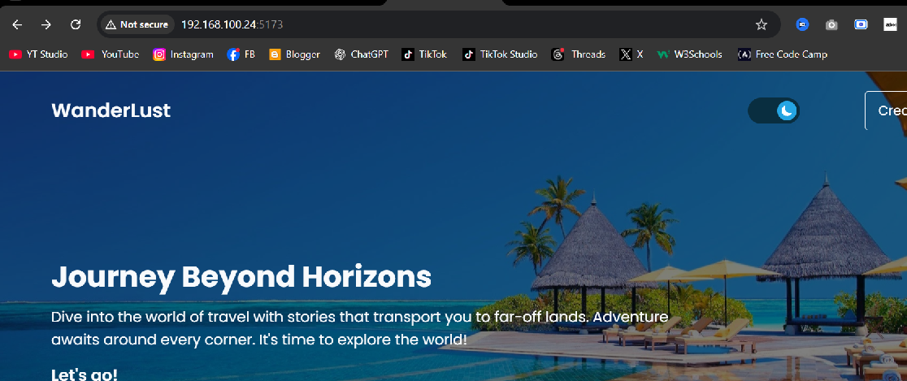
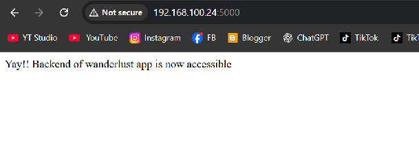

# 🚀 Wander Lust - Dockerized Full Stack Application

## 📌 Project Overview

Wander Lust is a full-stack blog-based web application where users can:

* View blog posts
* Add new posts
* Explore featured and categorized content

The application consists of:

1. **Frontend**: 

```

React (Vite)

```

2. `**Backend**:

```
 Node.js (Express)
```

3. **Database**: 

```
MongoDB
```

4.  **Cache**:

```
 Redis
```

---

## 🐳 Dockerization Objective

The main goal of this project was to containerize the complete application using Docker and Docker Compose so that all services run in isolated environments and can be started with a single command.

---

##  I NEED THESE THINGS FOR THE COMPLETING THE PROJECT :

* Docker
* Docker Compose
* Node.js
* React (Vite)
* MongoDB
* Redis

---

## 🛠️ Steps to Dockerize the Project

### 1. Clone the Repository

```
git clone https://github.com/moaazsaleemdevops-pixel/wnader-lust
```
***and than :***
```
cd wander-lust
```

---

### 2. Backend Dockerization

* Created a Dockerfile inside the backend folder
* Installed dependencies
* Exposed port 5000
* Fixed CMD issue:

```
CMD ["node", "server.js"]
```

---

### 3. Frontend Dockerization

* Created Dockerfile inside frontend
* Used Vite dev server
* Added host flag:

```
npm run dev -- --host
```

---

### 4. Docker Compose Setup

Created `docker-compose.yml` to manage services:

* backend
* frontend
* mongo
* redis

Also added environment variable:

```
VITE_API_PATH=http://backend:5000
```

---

### 5. Running the Project

```bash
docker-compose up --build
```

  



---

## ❌ Errors Faced & Solutions

### 1. Redis Image Pull Error

**Error:**

```
context deadline exceeded
```

**Solution:**

* Restarted Docker
* Checked internet connection
* Pulled image manually

---

### 2. MongoDB Crash (CPU Issue)

**Error:**

```
MongoDB requires AVX support
```

**Solution:**

* Changed image version:

```yaml
mongo:4.4
```

---

### 3. Docker Compose YAML Error

**Error:**

```
yaml.parser.ParserError
```

**Solution:**

* Fixed indentation
* Replaced tabs with spaces

---

### 4. Backend CMD Error

**Error:**

```
[node,: not found
```

**Solution:**

* Fixed Dockerfile CMD syntax

---

### 5. Frontend Not Accessible

**Problem:**
Frontend not opening via IP

**Solution:**

```bash
npm run dev -- --host
```

---

## 🧪 Testing Performed

* Verified frontend loads on browser
* Checked backend API endpoints
* Tested blog fetching
* Tested adding new blog posts
* Verified MongoDB connection
* Verified Redis connection

---

## ✅ Final Result

* All services running successfully in Docker containers
* Frontend and backend fully connected
* Application working as expected

---


---

##  Best Regards :
```
Moaaz Saleem
```
